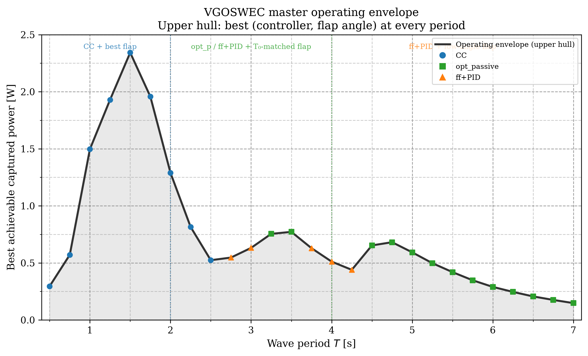

# VGOSWEC-45 Standalone C++ SEA-Stack Application

Standalone C++ downstream application simulating the model-scale **VGOSWEC-45**
(Variable-Geometry OSWEC, 45° panel — bottom-hinged flap) using the
[SEA-Stack](https://github.com/Project-SEA-Stack/SEA-Stack) framework and
Project Chrono for multi-body dynamics.

## Overview

- **Model**: Wave-tank-scale VGOSWEC (~1:40 Froude), hinged flap + fixed base
- **Default geometry**: `geometry/vgm45.obj` (flap), `geometry/stl_files/center_beam_w_foundation_BEM.STL` (base)
- **Default hydro data**: `hydroData/vgoswec_45.h5`
- **Wave default**: Regular waves, H = 0.05 m, T = 1.5 s
- **Four pluggable PTO controllers**: passive (placeholder — tune with tank data), optimal-passive, complex-conjugate, excitation-FF+PID

## Controller / flap-config co-design — three-regime relay

Across the full VGOSWEC flap-vent sweep (VGM-0 = vents closed → VGM-90 = vents fully
open), three controllers occupy complementary period bands in a clean relay:

- **CC (complex-conjugate)** dominates short periods (T ≲ 2 s), tracking the Budal
  theoretical optimum with up to 2.34 W at T = 1.5 s.
- **opt_passive** (optimal resistive damping) matches a tuned feedforward controller at
  each flap's resonance peak with a single tuning-free coefficient. The resonance hump
  marches across T = 2.5–4.75 s as the flap angle changes.
- **ff+PID** (excitation-feedforward + PID) carries the long-period tail past resonance
  with no reactive-power penalty.

The flap angle acts as a co-design knob that shifts the resonance period — and thus the
crossover between regimes — across the full T = 2.5–5 s band.



*Master operating envelope: upper hull of captured power over all (controller, flap-angle)
combinations at every wave period. CC + VGM-0 dominates short T; opt_passive and ff+PID
with the T₀-matched flap dominate resonance; ff+PID + VGM-0 dominates the long tail.
See [`analysis/FINDINGS_3REGIME.md`](analysis/FINDINGS_3REGIME.md) for the full findings.*

Reproduce all figures from committed CSVs (no solver needed):
```bash
python3 scripts/three_regime_comparison.py --plot-only
```

- Plant-validation foundation: [`docs/freedecay_validation.md`](docs/freedecay_validation.md)
- Simulation-data regeneration index: [`docs/REPRODUCTION.md`](docs/REPRODUCTION.md)

## Repository structure

```
cpp-vgoswec/
├── CMakeLists.txt          # Top-level CMake
├── README.md
├── LICENSE                 # MIT
├── .gitignore
├── scripts/
│   └── setup_env.sh        # Source to configure build environment
├── config/
│   ├── vgoswec_45_passive.yaml         # Linear viscous damper
│   ├── vgoswec_45_opt_passive.yaml     # Optimal passive damping at ω₀
│   ├── vgoswec_45_cc.yaml              # Complex-conjugate reactive control
│   └── vgoswec_45_exc_ff_pid.yaml      # Excitation-FF + PID (active)
├── src/
│   ├── demo_vgoswec.cpp        # Main simulation entry point
│   ├── active_pto.{h,cpp}      # Four IPTOModel implementations
│   ├── excitation_force_provider.{h,cpp}  # Excitation-force broadcast helper
│   ├── pid_controller.{h,cpp}  # Full PID with anti-windup
│   ├── rsda_pto_functor.{h,cpp}  # Rotational ChLinkRSDA::TorqueFunctor adapter
│   ├── impedance.{h,cpp}       # Impedance / CC-gain free functions
│   ├── config_loader.{h,cpp}   # YAML config loading
├── tests/
│   └── smoke_test.cpp          # Unit smoke tests (BUILD_TESTING)
└── docs/
    ├── CONTROLLERS.md          # Controller mathematics and tuning guide
    ├── HIL_MIGRATION.md        # How to drop in a ROS 2 / HIL controller
    └── MPC_TODO.md             # Future MPC roadmap
```

## Physical properties (model scale, ~1:40 Froude)

| Parameter | Value |
|-----------|-------|
| Flap mass | 7.60 kg (neutrally-buoyant assumption) |
| Flap CoG | (0, 0, −0.2352) m |
| Flap I_yy | 0.15 kg·m² *(TODO: bifilar pendulum or ID)* |
| Hinge z | −0.7658 m |
| Wave tank | H=0.05 m, T=1.5 s (regular default) |
| Sim duration | 60 s, dt=0.005 s |

## Prerequisites

- **SEA-Stack** (installed, `SEAStack_DIR` set)
- **Project Chrono** ≥ 10.0 with `CH_USE_SIMD=OFF`
- **yaml-cpp** ≥ 0.7
- **Eigen3** ≥ 3.4
- **For GUI/visualization** (optional — headless builds work without these):
  - **VulkanSceneGraph (VSG)** ≥ 1.1 (`vsg::vsg` CMake target)
  - **vsgXchange** ≥ 1.0 (asset loading for VSG; `vsgXchange::vsgXchange`)
  - **vsgImGui** ≥ 0.3 (in-scene UI overlay; `vsgImGui::vsgImGui`)
  - **Chrono VSG module** built alongside Chrono (`Chrono::Chrono_vsg`)
  - **SEA-Stack GUI helper header** present at `$HOME/SEA-Stack/apps/seastack/gui/guihelper.h` (from the SEA-Stack source tree)
  - **`libseastack_app_lib`** available in one of:
    - `$HOME/SEA-Stack/build/lib/Release/`
    - `$HOME/SEA-Stack/build/lib/`
    - `$HOME/SEA-Stack/install/lib/`
  When any of the above GUI components are absent CMake automatically falls back to a headless-only build that still compiles and produces CSV output.

## Build

```bash
# 1. Source the environment (adapt paths as needed)
source scripts/setup_env.sh

# 2. Configure and build
cmake -S . -B build \
  -DCMAKE_BUILD_TYPE=Release \
  -DCMAKE_PREFIX_PATH="${CMAKE_PREFIX_PATH}"
cmake --build build -j$(nproc)

# 3. Run (regular waves, passive damper)
./build/demo_vgoswec --config config/vgoswec_45_passive.yaml

# 4. Run with excitation-FF+PID controller
./build/demo_vgoswec --config config/vgoswec_45_exc_ff_pid.yaml

# 5. Run headless
./build/demo_vgoswec --config config/vgoswec_45_passive.yaml --no-viz
```

## Controller selection

Override the controller at runtime:
```bash
./build/demo_vgoswec --config config/vgoswec_45_passive.yaml --controller exc_ff_pid
```

Valid values: `passive`, `opt_passive`, `cc`, `exc_ff_pid`.

## HIL / ROS 2 integration

See [`docs/HIL_MIGRATION.md`](docs/HIL_MIGRATION.md). All four controllers implement
`seastack::pto::IPTOModel`, so a future ROS 2 node can drop in a `RosPTOModel`
without modifying the simulation.

## License

MIT — see [LICENSE](LICENSE).
