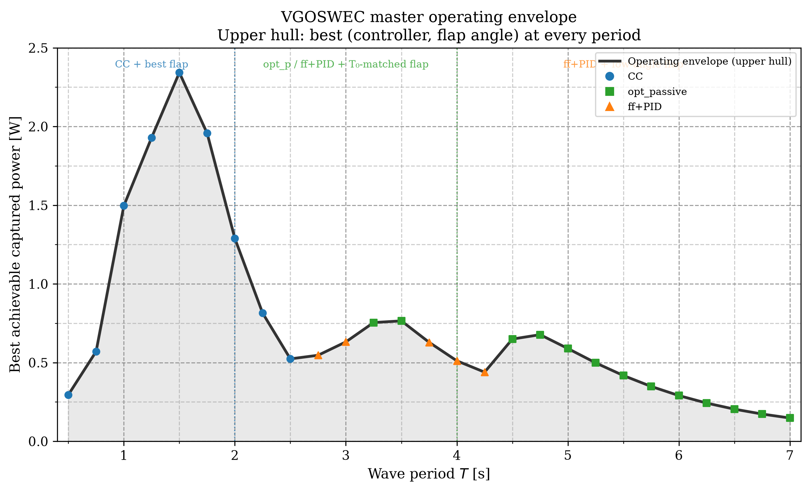

# VGOSWEC C++ SEA-Stack Application

Standalone C++ downstream application simulating the model-scale **VGOSWEC**
(Variable-Geometry OSWEC — bottom-hinged flap) using the
[SEA-Stack](https://github.com/Project-SEA-Stack/SEA-Stack) framework and
Project Chrono for multi-body dynamics.

## Overview

- **Model**: Wave-tank-scale VGOSWEC (~1:40 Froude), hinged flap + fixed base
- **Default geometry**: `geometry/vgm45.obj` (flap), `geometry/stl_files/center_beam_w_foundation_BEM.STL` (base)
- **Default hydro data**: `hydroData/vgoswec_45.h5`
- **Wave default**: Regular waves, H = 0.05 m, T = 1.5 s
- **Four pluggable PTO controllers**: passive (placeholder — tune with tank data), optimal-passive, complex-conjugate, excitation-FF+PID

## Controller / flap-config co-design — three-regime relay

Across the full VGOSWEC flap-vent sweep (VGM-0 = vents closed → VGM-90 = vents fully
open), three controllers occupy complementary period bands in a clean relay:

- **CC (complex-conjugate)** dominates short periods (T ≲ 2 s), tracking the Budal
  theoretical optimum with up to 2.34 W at T = 1.5 s.
- **opt_passive** (optimal resistive damping) matches a tuned feedforward controller at
  each flap's resonance peak with a single tuning-free coefficient. The resonance hump
  marches across T = 2.5–4.75 s as the flap angle changes.
- **ff+PID** (excitation-feedforward + PID) carries the long-period tail past resonance
  with no reactive-power penalty.

The flap angle acts as a co-design knob that shifts the resonance period — and thus the
crossover between regimes — across the full T = 2.5–5 s band.



*Master operating envelope: upper hull of captured power over all (controller, flap-angle)
combinations at every wave period. CC + VGM-0 dominates short T; opt_passive and ff+PID
with the T₀-matched flap dominate resonance; ff+PID + VGM-0 dominates the long tail.
See [`analysis/FINDINGS_3REGIME.md`](analysis/FINDINGS_3REGIME.md) for the full findings.*

Reproduce all figures from committed CSVs (no solver needed):
```bash
python3 scripts/three_regime_comparison.py --plot-only
```

- Plant-validation foundation: [`docs/freedecay_validation.md`](docs/freedecay_validation.md)
- Simulation-data regeneration index: [`docs/REPRODUCTION.md`](docs/REPRODUCTION.md)

## Repository structure

```
cpp-vgoswec/
├── CMakeLists.txt          # Top-level CMake
├── README.md
├── LICENSE                 # MIT
├── .gitignore
├── scripts/
│   ├── setup_env.sh        # Source to configure build environment
│   └── *.py                # Sweep / plotting / comparison drivers
├── config/
│   ├── vgoswec_45_passive.yaml         # Linear viscous damper
│   ├── vgoswec_45_opt_passive.yaml     # Optimal passive damping at ω₀
│   ├── vgoswec_45_cc.yaml              # Complex-conjugate reactive control
│   └── vgoswec_45_exc_ff_pid.yaml      # Excitation-FF + PID (active)
│                                       # (same four per flap: 0/10/20/45/90)
├── hydroData/              # BEMIO H5 coefficients, one per flap angle
├── geometry/               # Flap OBJ + base STL meshes
├── src/
│   ├── demo_vgoswec.cpp        # Main simulation entry point
│   ├── active_pto.{h,cpp}      # Four IPTOModel implementations
│   ├── excitation_force_provider.{h,cpp}  # Excitation-force broadcast helper
│   ├── pid_controller.{h,cpp}  # Full PID with anti-windup
│   ├── rsda_pto_functor.{h,cpp}  # Rotational ChLinkRSDA::TorqueFunctor adapter
│   ├── impedance.{h,cpp}       # Impedance / CC-gain free functions
│   ├── config_loader.{h,cpp}   # YAML config loading
├── tests/
│   └── smoke_test.cpp          # Unit smoke tests (BUILD_TESTING)
├── analysis/               # Committed CSVs + figures (see analysis/README.md)
├── output/                 # Run artifacts — gitignored, not reproducible from git
└── docs/
    ├── CONTROLLERS.md          # Controller mathematics and tuning guide
    ├── REPRODUCTION.md         # Repo-wide dataset regeneration index
    ├── freedecay_validation.md # Plant validation vs WEC-Sim
    ├── HIL_MIGRATION.md        # How to drop in a ROS 2 / HIL controller
    ├── MPC_TODO.md             # Future MPC roadmap
    └── EOD_SUMMARY_*.md        # End-of-day phase notes
```

> **Note:** `output/` is gitignored. Only the derived CSVs under `analysis/` are
> committed — raw per-run time series are not recoverable from the repository and
> must be regenerated by re-running the solver.

## Physical properties (model scale, ~1:40 Froude)

| Parameter | Value |
|-----------|-------|
| Flap mass | 6.676 kg |
| Flap CoG | (0, 0, −0.235) m |
| Flap I_yy | 0.21 kg·m² (about CG) |
| Hinge z | −0.5 m |
| Wave tank | H=0.05 m, T=1.5 s (regular default) |
| Sim duration | 60 s, dt=0.005 s |

## Prerequisites

- **SEA-Stack** (installed, `SEAStack_DIR` set)
- **Project Chrono** ≥ 10.0, installed (not build-tree), with the **same
  `-march=native` / SIMD settings as everything it shares Eigen objects with**

  > **ABI warning.** Chrono v10 exports `-march=native` to consumers, which sets
  > `EIGEN_MAX_ALIGN_BYTES=32`. Any downstream code exchanging Eigen objects with
  > Chrono-linked code must match, or Eigen allocates with `malloc` and frees with
  > `handmade_aligned_free` → heap-buffer-overflow. This bit us via
  > `HydroData::GetInfAddedMassMatrix` crossing into `cpp-vgoswec`.
  >
  > Older notes in this repo claimed SEA-Stack requires `CH_USE_SIMD=OFF`. The
  > current working stack is built with **SIMD ON** and `-march=native`, and builds
  > and runs clean. Treat the `OFF` claim as unverified until confirmed against
  > SEA-Stack's own build configuration.

- **yaml-cpp** ≥ 0.7
- **Eigen3** ≥ 3.4
- **For GUI/visualization** (optional — headless builds work without these):
  - **VulkanSceneGraph (VSG)** ≥ 1.1 (`vsg::vsg` CMake target)
  - **vsgXchange** ≥ 1.0 (asset loading for VSG; `vsgXchange::vsgXchange`)
  - **vsgImGui** ≥ 0.3 (in-scene UI overlay; `vsgImGui::vsgImGui`)
  - **Chrono VSG module** built alongside Chrono (`Chrono::Chrono_vsg`)
  - **SEA-Stack GUI helper header** present at `$HOME/SEA-Stack/apps/seastack/gui/guihelper.h` (from the SEA-Stack source tree)
  - **`libseastack_app_lib`** available in one of:
    - `$HOME/SEA-Stack/build/lib/Release/`
    - `$HOME/SEA-Stack/build/lib/`
    - `$HOME/SEA-Stack/install/lib/`
  When any of the above GUI components are absent CMake automatically falls back to a headless-only build that still compiles and produces CSV output.

## Environment

Two equivalent ways to configure the build environment. Both have been verified to
produce a clean configure, build, and run.

**Option A — repo-local script** (self-contained, works on any machine):

```bash
source scripts/setup_env.sh
```

**Option B — toolchain aliases** (if you maintain `~/env/` toolchain scripts;
see `~/TOOLCHAIN.md`):

```bash
chrono10 && seastack
```

Either sets `Chrono_DIR`, `SEAStack_DIR`, `CHRONO_DATA_DIR`, `VSG_FILE_PATH`,
`CMAKE_PREFIX_PATH`, and `LD_LIBRARY_PATH`. Option B additionally guarantees that
only one Chrono flavor is active per shell.

> **Do not mix the two in one shell.** `scripts/setup_env.sh` sets these variables
> independently and does not clear a previously-sourced toolchain, so
> `chrono-dev` followed by `source scripts/setup_env.sh` can leave two Chrono
> installations on `LD_LIBRARY_PATH`. The dynamic loader then silently picks
> whichever comes first. Use one mechanism per shell.

`VSG_FILE_PATH` must point at the Chrono data directory itself, **not** at
`data/vsg` — VSG resolves assets as `vsg/fonts/...` relative to that root. One
level too deep and the renderer segfaults on the first frame.

## Build

```bash
# 1. Configure the environment (see above)
source scripts/setup_env.sh      # ...or: chrono10 && seastack

# 2. Configure and build
cmake -S . -B build -DCMAKE_BUILD_TYPE=RelWithDebInfo
cmake --build build -j$(nproc)

# 3. Run (regular waves, passive damper)
./build/demo_vgoswec --config config/vgoswec_45_passive.yaml

# 4. Run with excitation-FF+PID controller
./build/demo_vgoswec --config config/vgoswec_45_exc_ff_pid.yaml

# 5. Run headless
./build/demo_vgoswec --config config/vgoswec_45_passive.yaml --no-viz
```

### Known configure-time warnings (benign)

- **`CMP0144` / `SEASTACK_ROOT`, `CHRONO_ROOT`** — CMake < 3.27 policy default
  ignores upper-case `<PACKAGENAME>_ROOT` environment variables. Both packages are
  located via `CMAKE_PREFIX_PATH` instead, so the warning is informational.
- **`libyaml-cpp.so.0.8` runtime search path conflict** — a system yaml-cpp in
  `/usr/lib/x86_64-linux-gnu` may be shadowed by Chrono's bundled copy. Harmless
  for the current targets.
- **`Chrono libraries not found for the debug configuration`** — expected for
  `Release` / `RelWithDebInfo`. A `-DCMAKE_BUILD_TYPE=Debug` build **will** fail to
  link unless Chrono is also built Debug.

## Controller selection

Override the controller at runtime:
```bash
./build/demo_vgoswec --config config/vgoswec_45_passive.yaml --controller exc_ff_pid
```

Valid values: `passive`, `opt_passive`, `cc`, `exc_ff_pid`.

## HIL / ROS 2 integration

See [`docs/HIL_MIGRATION.md`](docs/HIL_MIGRATION.md). All four controllers implement
`seastack::pto::IPTOModel`, so a future ROS 2 node can drop in a `RosPTOModel`
without modifying the simulation.

## License

MIT — see [LICENSE](LICENSE).
