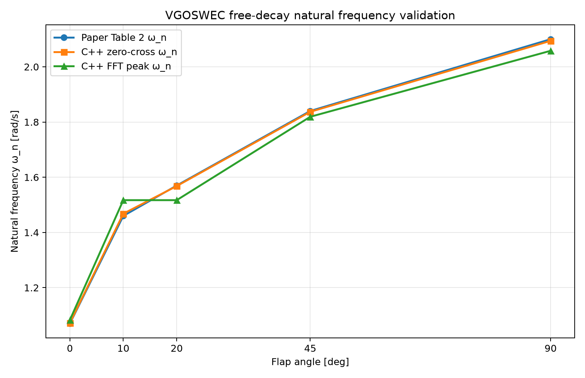

# Free-decay validation of the C++ VGOSWEC model against Husain et al. (Ogden et al., ASME JOMAE 145(3):030905), Table 2

## Purpose

This validation demonstrates that spring-only free-decay simulations in the C++ VGOSWEC model recover the natural frequency for each available geometry and reproduce the free-decay values reported in Husain et al. / Ogden et al. (ASME JOMAE 145(3):030905), Table 2.

## Method

- No incident waves: `wave.type: none`
- External hinge spring is the only restoring mechanism: `C_ext = 6.57 N·m/rad`
- Initial condition: `initial_pitch = 0.15 rad`
- Controller: passive with `B_pto = 0` (pure free oscillation; no PTO damping torque)
- Dynamics are solved in Chrono time-domain simulation with coupled surge–pitch–hinge motion and hydrodynamic radiation convolution; resonance is therefore measured from the full coupled plant response, not from a single-DOF closed-form estimate.
- Natural frequency is extracted from `flap_pitch_rad` using:
  1. FFT peak pick
  2. Zero-crossing period estimate

> Note: `omega_n_pred` startup diagnostics are approximate single-DOF estimates and are **not** used as the validation metric here.

## Body properties used (constant for all angles)

These values are WEC-Sim-validated and intentionally held fixed across the geometric sweep for this free-decay validation; only the BEM hydro file changes by angle.

| Property | Value |
|---|---:|
| Flap mass | 6.676 kg |
| Flap CG | [0, 0, -0.235] m |
| Radius to hinge `r_g` | 0.265 m |
| CG inertia `Ixx` | 0.32 kg·m² |
| CG inertia `Iyy` | 0.21 kg·m² |
| CG inertia `Izz` | 0.12 kg·m² |
| Hinge location `z` | -0.5 m |
| External hinge stiffness `C_ext` | 6.57 N·m/rad |

## Results vs paper (Table 2)

| Config | Paper ω_n [rad/s] | Paper T_s [s] | Paper ζ×10⁻⁴ | C++ zero-cross ω_n [rad/s] | C++ FFT ω_n [rad/s] | Zero-cross error |
|---|---:|---:|---:|---:|---:|---:|
| VGM-0  | 1.07 | 5.86 | 5.8 | 1.072 | 1.083 | +0.2% |
| VGM-10 | 1.46 | 4.29 | 4.3 | 1.468 | 1.517 | +0.6% |
| VGM-20 | 1.57 | 4.01 | 4.1 | 1.568 | 1.517 | -0.1% |
| VGM-45 | 1.84 | 3.42 | 3.5 | 1.837 | 1.819 | -0.2% |
| VGM-90 | 2.10 | 2.99 | 3.2 | 2.094 | 2.058 | -0.3% |

Zero-crossing agreement is within **±0.6%** at every angle, and the trend is monotonic with flap angle: **1.07 → 1.46 → 1.57 → 1.84 → 2.10 rad/s**, matching the paper.

## Validation figure



## FFT bin-resolution caveat (important)

For a ~55 s record, FFT resolution is approximately:

- `Δf ≈ 1/55 ≈ 0.018 Hz`
- `Δω = 2πΔf ≈ 0.11 rad/s` per bin

VGM-10 (1.46 rad/s) and VGM-20 (1.57 rad/s) are separated by ~0.11 rad/s, so they can land in the same FFT bin for naive peak picking, yielding identical FFT estimates (1.517 rad/s). Zero-crossing resolves these cleanly (1.468 vs 1.568 rad/s). This is a windowing/bin-quantization artifact, not a plant-physics error. The paper’s own FFT-vs-period presentation has the same finite-resolution limitation, so tabulated FFT-read values naturally carry a few-percent windowing uncertainty.

## Reproduction

Run free-decay cases:

```bash
for dev in 0 10 20 45 90; do
  ./build/demo_vgoswec --config config/vgoswec_${dev}_freedecay.yaml --no-viz > /dev/null 2>&1
  # then FFT / zero-cross the flap_pitch_rad column of output/vgoswec_${dev}_freedecay_results.csv
done
```

Quick Python extraction (robust to NaNs, sorted time, and transient removal):

```python
import csv
import math
from pathlib import Path

import numpy as np


def estimate_wn(csv_path: Path, transient_s: float = 2.0):
    t, x = [], []
    with csv_path.open(newline="") as fh:
        r = csv.DictReader(fh)
        for row in r:
            try:
                ti = float(row["time_s"])
                xi = float(row["flap_pitch_rad"])
            except (KeyError, ValueError, TypeError):
                continue
            if not (math.isfinite(ti) and math.isfinite(xi)):
                continue
            t.append(ti)
            x.append(xi)

    if len(t) < 16:
        raise RuntimeError(f"Not enough valid rows in {csv_path}")

    idx = np.argsort(np.asarray(t))
    t = np.asarray(t)[idx]
    x = np.asarray(x)[idx]

    mask = t >= (t[0] + transient_s)
    t = t[mask]
    x = x[mask]
    if len(t) < 16:
        raise RuntimeError("Not enough post-transient samples")

    x = x - np.mean(x)  # detrend (constant)
    dt = float(np.median(np.diff(t)))

    # FFT estimate
    freqs = np.fft.rfftfreq(len(x), d=dt)
    amps = np.abs(np.fft.rfft(x))
    amps[0] = 0.0
    k = int(np.argmax(amps))
    wn_fft = 2.0 * math.pi * freqs[k]

    # Zero-crossing estimate (upward crossings, linear interpolation)
    zc = []
    for i in range(1, len(x)):
        if x[i - 1] < 0.0 <= x[i]:
            dx = x[i] - x[i - 1]
            if dx == 0.0:
                continue
            alpha = -x[i - 1] / dx
            zc.append(t[i - 1] + alpha * (t[i] - t[i - 1]))
    if len(zc) < 2:
        raise RuntimeError("Insufficient zero crossings")

    periods = np.diff(np.asarray(zc))
    T = float(np.median(periods))
    wn_zc = 2.0 * math.pi / T

    return wn_fft, wn_zc


for dev in [0, 10, 20, 45, 90]:
    path = Path(f"output/vgoswec_{dev}_freedecay_results.csv")
    w_fft, w_zc = estimate_wn(path)
    print(f"VGM-{dev:>2}: FFT={w_fft:.3f} rad/s, zero-cross={w_zc:.3f} rad/s")
```

A reusable plotting script is provided at `scripts/plot_freedecay_validation.py`.

## Conclusion

Across the full 0°–90° sweep (0°, 10°, 20°, 45°, 90°), the C++ VGOSWEC free-decay natural frequencies match Husain et al. Table 2 within about **0.6%** using zero-crossing extraction and preserve the same monotonic geometry trend. This validates the plant free-decay resonance behavior (mass/inertia with `Iyy=0.21` about CG, CG location, hinge spring, and BEM hydro coupling) across geometries. Controller power-capture tuning remains a separate topic (including analytic impedance-gain considerations in `impedance.cpp`).
