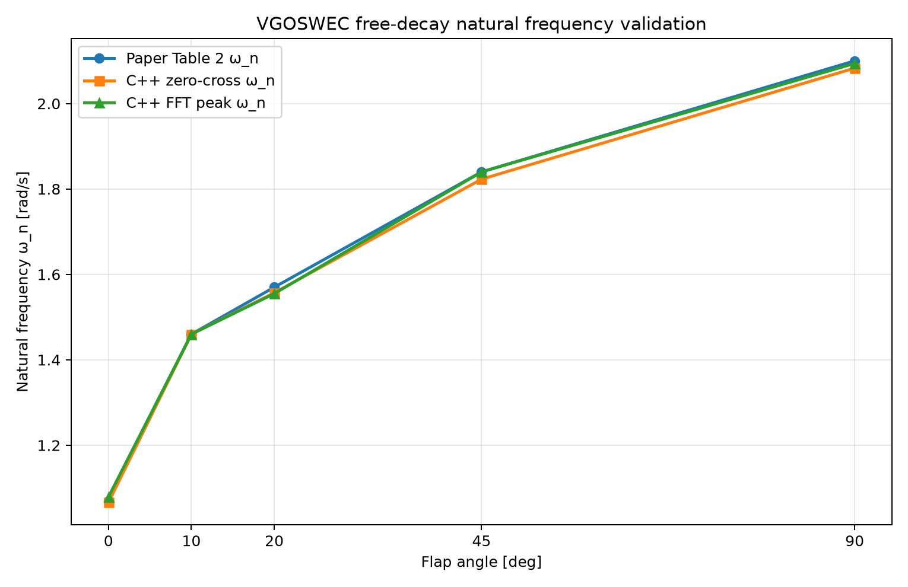
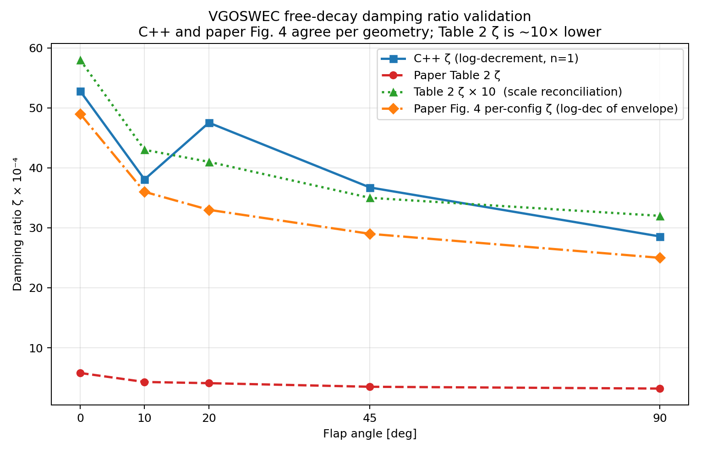
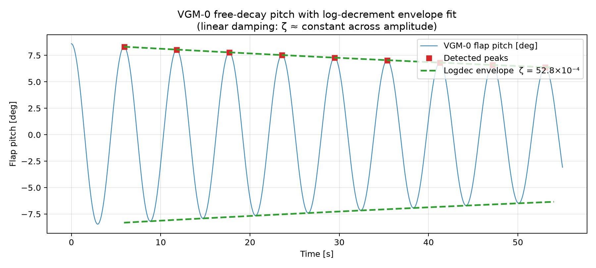

# Free-decay validation of the C++ VGOSWEC model

## Status

This document records the repository-native C++ free-decay validation workflow and its comparison against Ogden et al. (ASME JOMAE 145(3):030905), Table 2 and Fig. 4.

**Primary damping-ratio reference:** for ζ, the strongest reference is now the direct comparison against the original WEC-Sim raw free-decay time histories documented in [`docs/freedecay_wecsim_rawdata_validation.md`](freedecay_wecsim_rawdata_validation.md). The published Table 2 ζ column is retained here for traceability, but it is no longer treated as the authoritative damping-ratio target because both WEC-Sim raw data and the C++ model give ζ values about 9–13× larger than Table 2 as printed.

**Primary natural-frequency result:** C++ 200 s free-decay records agree with the WEC-Sim raw-data FFT/zero-crossing extraction within ±0.17% across VGM-0/10/20/45/90. This is tighter than comparison against the rounded paper Table 2 values.

---

## Foundation: plant validation against WEC-Sim

This validation is the foundation on which the three-regime controller/flap co-design study rests. The co-design results are only meaningful because the plant's:

- **reactive impedance** — natural frequency **ω_n**, governed by added inertia **A55**, body inertia, and hinge stiffness; and
- **resistive impedance** — damping ratio **ζ**, i.e. radiation damping **B55**;

are validated across the full **0°–90°** VGOSWEC geometric sweep: VGM-0/10/20/45/90.

Validating **ω_n** confirms the reactive plant physics used by the **CC** and **opt_passive** impedance-matching arguments. Validating **ζ / B55** confirms the radiation damping that sets **P_opt** and therefore the capture-efficiency denominator used throughout the three-regime analysis.

---

## Method

- No incident waves: `wave.type: none`
- External hinge spring is the only restoring mechanism: `C_ext = 6.57 N·m/rad`
- Initial condition: `initial_pitch = 0.15 rad`
- Controller: passive with `B_pto = 0` — pure free oscillation; no PTO damping torque
- Dynamics are solved in Chrono time-domain simulation with coupled surge–pitch–hinge motion and hydrodynamic radiation convolution. Resonance is measured from the full coupled plant response, not from a single-DOF closed-form approximation.
- Natural frequency is extracted from `flap_pitch_rad` using FFT peak-picking and zero-crossing period estimation.
- Damping ratio is extracted from `flap_pitch_rad` using logarithmic decrement.

> `omega_n_pred` startup diagnostics are approximate single-DOF estimates and are **not** used as the validation metric here.

---

## Body properties used

These values are WEC-Sim-validated and intentionally held fixed across the geometric sweep for this free-decay validation; only the BEM hydro file changes by angle.

| Property | Value |
|---|---:|
| Flap mass | 6.676 kg |
| Flap CG | [0, 0, -0.235] m |
| Radius to hinge `r_g` | 0.265 m |
| CG inertia `Ixx` | 0.32 kg·m² |
| CG inertia `Iyy` | 0.21 kg·m² |
| CG inertia `Izz` | 0.12 kg·m² |
| Hinge location `z` | -0.5 m |
| External hinge stiffness `C_ext` | 6.57 N·m/rad |

---

## 2026-09-17 result set: 200 s free-decay records

The free-decay records were harmonized to **200 s** for all five geometries to match the paper Fig. 4 record length and to remove the previous short-record FFT bin-resolution ambiguity. The regenerated result files were produced at commit `3717147` with `CHRONO_FLAVOR=v10`.

| Config | Paper Table 2 ω_n [rad/s] | Paper T_s [s] | Paper Table 2 ζ×10⁻⁴ | C++ zero-cross ω_n [rad/s] | C++ FFT ω_n [rad/s] | Zero-cross error vs Table 2 | C++ ζ×10⁻⁴ |
|---|---:|---:|---:|---:|---:|---:|---:|
| VGM-0  | 1.070 | 5.86 | 5.8 | 1.066 | 1.079 | -0.4% | 52.8 |
| VGM-10 | 1.460 | 4.29 | 4.3 | 1.460 | 1.460 | -0.0% | 38.1 |
| VGM-20 | 1.570 | 4.01 | 4.1 | 1.557 | 1.555 | -0.8% | 47.5 |
| VGM-45 | 1.840 | 3.42 | 3.5 | 1.823 | 1.840 | -0.9% | 36.7 |
| VGM-90 | 2.100 | 2.99 | 3.2 | 2.083 | 2.094 | -0.8% | 28.6 |

Against the rounded Table 2 values, C++ zero-crossing agreement is within **±0.9%** at every angle. Against the original WEC-Sim raw time histories, agreement is much tighter — within **±0.17%** using independent FFT/zero-crossing estimators. See [`docs/freedecay_wecsim_rawdata_validation.md`](freedecay_wecsim_rawdata_validation.md).

---

## Direct WEC-Sim raw-data validation

The owner located the original WEC-Sim `.mat` free-decay outputs (`FreeDecay_vg{1..5}_intAng1.mat`). Those files contain the raw pitch histories used to generate the paper:

- time vector: `output.wave.time`
- pitch signal: `output.bodies(1).position(:,5)`

The extraction is documented in detail in [`docs/freedecay_wecsim_rawdata_validation.md`](freedecay_wecsim_rawdata_validation.md). The key results are summarized here.

### Natural frequency: C++ vs WEC-Sim raw histories

| VGM | WEC-Sim FFT-interp ω [rad/s] | WEC-Sim zero-cross ω [rad/s] | C++ 200 s zero-cross ω [rad/s] |
|---|---:|---:|---:|
| 0  | 1.0656 | 1.0642 | 1.066 |
| 10 | 1.4597 | 1.4579 | 1.460 |
| 20 | 1.5581 | 1.5562 | 1.557 |
| 45 | 1.8241 | 1.8221 | 1.823 |
| 90 | 2.0850 | 2.0829 | 2.083 |

**Conclusion:** the C++ model reproduces the WEC-Sim raw-data natural frequencies within **±0.17%** across all five geometries. This confirms the reactive impedance of the plant.

### Damping ratio: C++ vs WEC-Sim raw histories

| VGM | WEC-Sim fitted ζ×10⁻⁴ | C++ 200 s log-decrement ζ×10⁻⁴ | Difference | Paper Table 2 ζ×10⁻⁴ |
|---|---:|---:|---:|---:|
| 0  | 55.3 | 52.8 | -4.6%  | 5.8 |
| 10 | 42.4 | 38.1 | -10.2% | 4.3 |
| 20 | 53.5 | 47.5 | -11.2% | 4.1 |
| 45 | 42.0 | 36.7 | -12.6% | 3.5 |
| 90 | 31.4 | 28.6 | -9.0%  | 3.2 |

**Conclusion:** C++ and WEC-Sim ζ agree in magnitude and trend to within roughly **5–13%**, using independent estimators on independent solver outputs. Both solvers place ζ in the **tens-of-×10⁻⁴** range. The published Table 2 ζ values are uniformly about **9–13× lower**.

This is now the primary ζ validation result. The Fig. 4 and Table 2 comparisons below are retained as corroboration and provenance.

---

## Validation figures







---

## FFT bin-resolution note

The original shorter C++ records were 40–60 s long. For a ~55 s record, FFT resolution is approximately:

- `Δf ≈ 1/55 ≈ 0.018 Hz`
- `Δω = 2πΔf ≈ 0.11 rad/s` per bin

VGM-10 (≈1.46 rad/s) and VGM-20 (≈1.57 rad/s) are separated by about one such FFT bin, so naive FFT peak-picking could place them in the same bin. This occurred in the earlier 60 s C++ analysis, where both returned 1.517 rad/s by FFT while zero-crossing separated them correctly.

The 2026-09-17 200 s records resolve this issue: FFT and zero-crossing now separate VGM-10 and VGM-20 cleanly.

---

## Damping-ratio method: logarithmic decrement

Damping ratio ζ is extracted from the C++ `flap_pitch_rad` free-decay time series using logarithmic decrement:

$$
\delta = \frac{1}{N}\ln\!\frac{A_0}{A_N}, \qquad
\zeta = \frac{\delta}{\sqrt{4\pi^2 + \delta^2}}
       = \frac{1}{\sqrt{1 + \left(\tfrac{2\pi}{\delta}\right)^2}}
$$

where `A_0` is the first retained positive peak amplitude, `A_N` is the last retained positive peak amplitude, and `N` is the number of cycles between them, i.e. retained peak count minus one.

> **`n` pitfall:** the formula gives the *per-cycle* decrement. Adjacent peaks are one cycle apart, so the correct call for adjacent peaks is `n=1`. Passing `n=2` for adjacent peaks halves δ and therefore approximately halves ζ for small damping. That produces a ×2 error, not the full ×10 Table 2 discrepancy.

The C++ analysis uses adjacent-cycle-compatible peak indexing and a full-record log-decrement over retained positive peaks.

---

## Paper Fig. 4 cross-check

The paper's Fig. 4 shows nondimensional pitch free-decay histories over approximately 200 s. The nondimensional envelope decays from approximately 1.0 to approximately 0.35. A direct envelope log-decrement gives ζ in the tens-of-×10⁻⁴ range, not the single-digit ×10⁻⁴ range printed in Table 2.

Using each geometry's own period gives the following approximate figure-read estimates:

| Config | T_s [s] | N ≈ 200/T_s | Paper Fig. 4 ζ×10⁻⁴ | C++ 200 s ζ×10⁻⁴ | Table 2 ζ×10⁻⁴ | Fig. 4 / Table 2 |
|---|---:|---:|---:|---:|---:|---:|
| VGM-0  | 5.86 | ~34 | ≈49 | 52.8 | 5.8 | ~8.4× |
| VGM-10 | 4.29 | ~47 | ≈36 | 38.1 | 4.3 | ~8.4× |
| VGM-20 | 4.01 | ~50 | ≈33 | 47.5 | 4.1 | ~8.0× |
| VGM-45 | 3.42 | ~58 | ≈29 | 36.7 | 3.5 | ~8.3× |
| VGM-90 | 2.99 | ~67 | ≈25 | 28.6 | 3.2 | ~7.8× |

The Fig. 4 values are approximate because they are read from a plotted envelope, not from digitized raw data. Their role is corroborative. The direct WEC-Sim raw-data comparison above is the stronger ζ reference.

---

## Interpretation of the Table 2 ζ discrepancy

The C++ model and the WEC-Sim raw time histories agree that ζ is in the **25–55×10⁻⁴** range. The paper Table 2 ζ column lists **3.2–5.8×10⁻⁴**. The ratio is nearly scalar across the sweep rather than geometry-dependent.

This pattern is consistent with a table exponent/scale issue — e.g. `×10⁻³` vs `×10⁻⁴` — rather than a plant-model error. A physical hydrodynamic discrepancy would generally vary with geometry; it would not appear as a nearly constant factor across VGM-0/10/20/45/90.

A plausibility check reaches the same conclusion:

- ζ ≈ 40×10⁻⁴ gives `Q ≈ 1/(2ζ) ≈ 125`, plausible for a BEM radiation-damped wetted flap.
- ζ ≈ 4×10⁻⁴ gives `Q ≈ 1250`, implausibly under-damped for this open-water free-decay problem.

---

## Numerical timestep sensitivity

Refining the integrator timestep slightly lowers the extracted VGM-0 ζ because of reduced numerical dissipation:

| Config | dt = 0.005 s | dt = 0.0005 s |
|---|---:|---:|
| VGM-0 ζ×10⁻⁴ | 54 | 50 |

The 2026-09-17 200 s campaign uses the config timestep `dt = 0.005 s`, so the appropriate VGM-0 C++ ζ value for that campaign is **52.8×10⁻⁴**. The refined-timestep value remains useful as a sensitivity check, but it should not be mixed into the standard-config result table.

The timestep effect is minor compared with the Table 2 scale discrepancy and does not change the conclusion.

---

## Reproduction from a clean checkout

1. **Build the SEA-Stack / Chrono binary**

   ```bash
   source scripts/setup_env.sh
   cmake -S . -B build \
     -DCMAKE_BUILD_TYPE=Release \
     -DCMAKE_PREFIX_PATH="${CMAKE_PREFIX_PATH}"
   cmake --build build -j$(nproc)
   ```

2. **Run the free-decay cases**

   ```bash
   for deg in 0 10 20 45 90; do
     ./build/demo_vgoswec --config config/vgoswec_${deg}_freedecay.yaml --no-viz
   done
   ```

   Each case writes `output/vgoswec_${deg}_freedecay_results.csv`.

3. **Run the unified free-decay analysis**

   ```bash
   python3 scripts/freedecay_validation.py --make-figures --paper-fig-zeta
   ```

   This writes:

   - `docs/freedecay_validation.csv`
   - `docs/img/freedecay_zeta_validation.png`
   - `docs/img/freedecay_zeta_decay_fit.png`

4. **Refresh the ω_n summary figure**

   ```bash
   python3 scripts/plot_freedecay_validation.py
   ```

   This writes:

   - `docs/img/freedecay_validation.png`

> **Important provenance note:** `scripts/freedecay_validation.py` and `scripts/plot_freedecay_validation.py` contain embedded fallback values for historical reproducibility. For campaign-grade runs, clear or archive existing `output/vgoswec_*_freedecay_results.csv` files first, run the solver explicitly, confirm fresh output timestamps, and then run the analysis. Otherwise a missing or unreadable solver output can be masked by fallback values.

---

## Conclusion

The C++ VGOSWEC free-decay plant model is validated on both key metrics:

1. **Natural frequency ω_n:** C++ 200 s free-decay records match the original WEC-Sim raw-data FFT/zero-crossing extraction within **±0.17%** across all five geometries. This validates the reactive plant physics: body inertia, hinge spring, and BEM added-mass coupling.

2. **Damping ratio ζ:** C++ log-decrement values match damping extracted directly from WEC-Sim raw time histories within **~5–13%** and agree in magnitude with the paper Fig. 4 envelope. Both solvers place ζ in the **25–55×10⁻⁴** range. The paper Table 2 ζ column, as printed, is uniformly about **9–13× lower** and is best interpreted as a scale/exponent inconsistency rather than a model discrepancy.

The plant validation is therefore banked. No C++ model rewrite is indicated by the free-decay evidence; downstream focus should return to SEA-Stack/capture-efficiency issues, especially the `rho = 1025` config value versus `rho = 1000` stored in the H5 hydro data.
